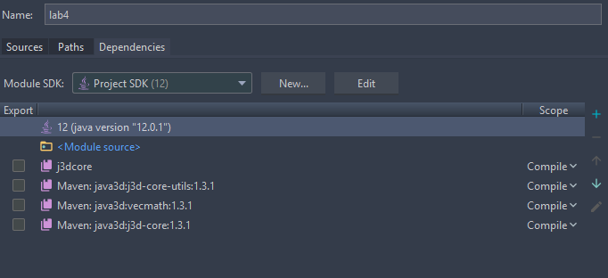

# Graphics &middot; [](https://opensource.org/licenses/Apache-2.0) [](https://travis-ci.org/Blahodatny/Graphics) [](https://snyk.io/test/github/Blahodatny/Graphics?targetFile=pom.xml)

## Lab 1
To execute JavaFX Application run:
``````
mvn compile exec:java -pl {name of module} -Dexec.mainClass={name of Main Class}
``````

If you see the following error when running *mvn compile*:
```text
[ERROR] Failed to execute goal org.codehaus.mojo:exec-maven-plugin:1.6.0:java (default-cli) on project lab1: An exception occured while executing the Java class. The specified mainClass doesn't contain a main method with appropriate signature.: com.project.Variant2.main([Ljava.lang.String;) -> [Help 1]
```

Insert that method in one of JavaFX running classes:
```java
public static void main(String... args) {
    launch();
}
```
After executing you can get rid of it &#128522;
___

## Lab 3
Read some beneficial articles before exploring third lab:

* [*What is Bitmap Picture?* (на русском)](https://ru.wikipedia.org/wiki/BMP)

* [More detailed exploration of BMP File Format](https://en.wikipedia.org/wiki/BMP_file_format)

</img>
___

## Lab 4
### Windows configuration
To configure Java3D on Windows OS:
1. Copy *.jar* files from **lib/Java3D/1.5.1/lib/ext** directory to 
   **C:\Program Files\Java\jdk-16.0.1\lib**.
2. Copy *j3dcore-ogl.dll* file from **lib/Java3D/1.5.1/bin/windows** to 
   **C:\Program Files\Java\jdk-16.0.1\bin**.
### Linux configuration
* Copy *.jar* files:
```jvm
(cd lib/Java3D/1.5.1/lib/ext; sudo cp j3dcore.jar j3dutils.jar vecmath.jar /usr/lib/jvm/java-16-oracle/lib)
```
* Copy config file:
```jvm
sudo cp lib/Java3D/1.5.1/bin/linux/libj3dcore-ogl.so /usr/lib/
```
The following steps are common for both OS:
* File -> Project Structure -> Libraries -> New Project Library, and then select 3 *.jar* files from **lib/Java3D/1.5.1/lib/ext**.
* File -> Project Structure -> Modules -> lab4 -> Dependecies -> Add -> 
Library, and select library you've created in the previous step and give it the first priority like shown in screen:

</img>

* Run program
___
